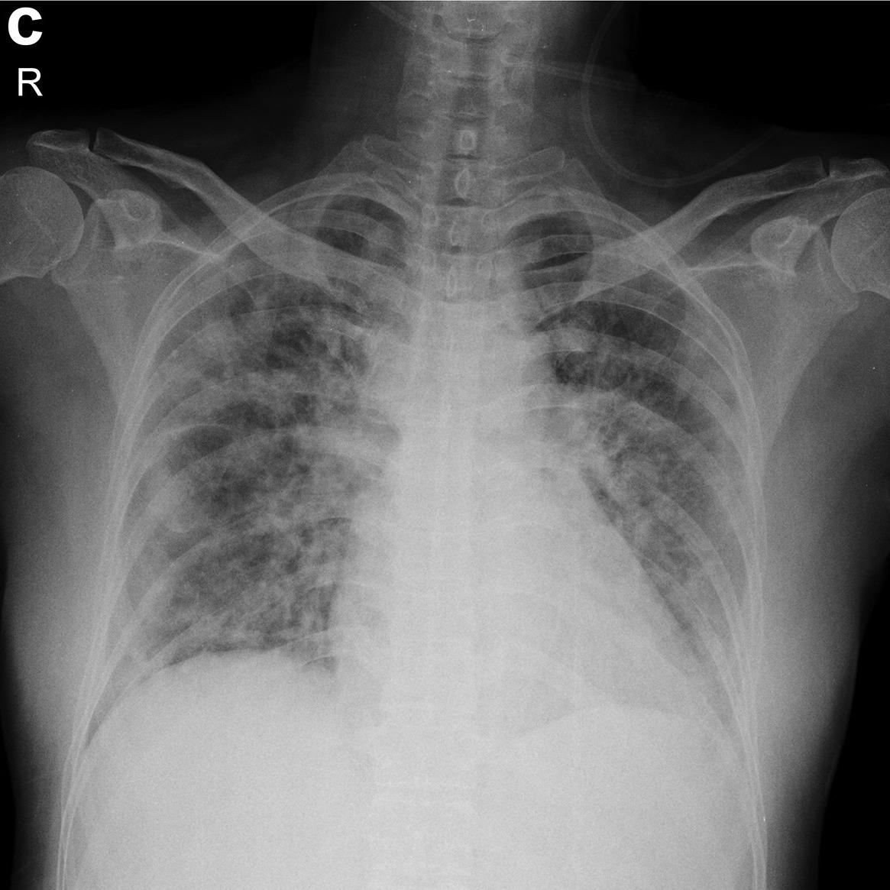

# Detector_covid-19
Detecção de COVID-19 em imagens de raios-X com Keras, TensorFlow e Deep Learning

## Detector COVID-19 automático 94,10% de Acurácia.
- 100% de sensibilidade 
- 92% de especificidade

## ATENÇÃO
- Os métodos e técnicas usados neste vídeo são apenas para fins educacionais. Esse não é um estudo cientificamente rigoroso, nem será publicado em uma revista científica´.

## IDEIA ORIGINAL: 
[Adam Rosembrock](https://www.pyimagesearch.com/2020/03/16/detecting-covid-19-in-x-ray-images-with-keras-tensorflow-and-deep-learning/)
#### Todos os créditos ao professor [Sandeco](https://www.youtube.com/channel/UCIQne9yW4TvCCNYQLszfXCQ)

